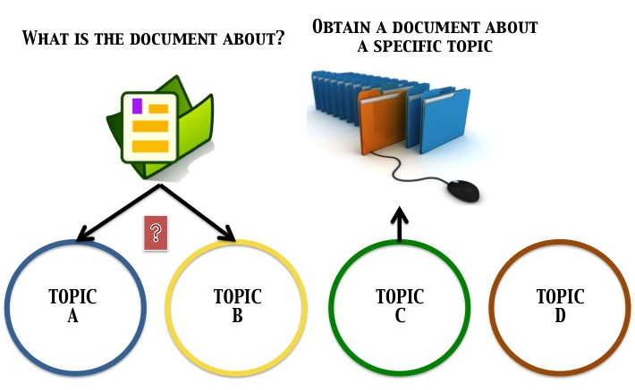
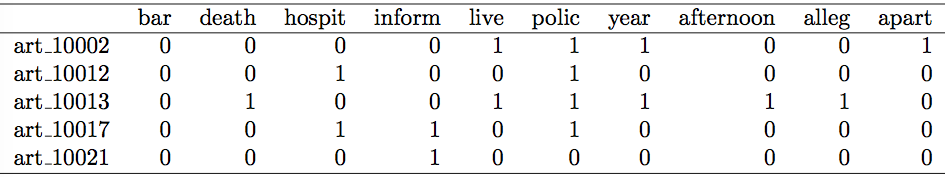
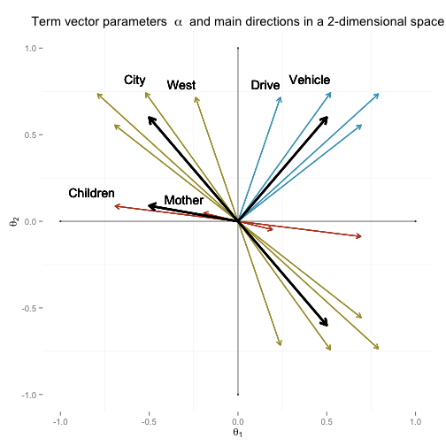
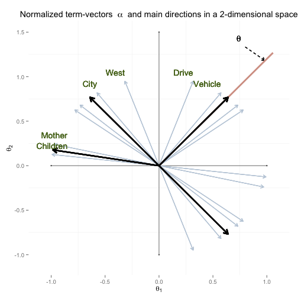

## Overall sketch 

<footer>  Textual Analysis Using a Latent Regression Model </footer>
<header>
 
</header>

---
## Text Corpus Data

<code> In order to present our method, we have chosen the following corpus 
 
 
</code>
<h5> 800 News articles about deaths in the USA   <code> Unit of analysis:</code> Body of the article
 
 
</h5>

<footer>  Textual Analysis Using a Latent Regression Model </footer>
<header>
 
</header>

--- &vcenter

## Introduction

> * Here we will present the use of a latent linear model to perform textual analysis. The main purpose is to `discover what topics occur` in a collection of documents
> * The method involves a bayesian estimation of a `multivariate latent linear model` over a document-term matrix
> * Topics will be calculated as vectors by grouping terms according to their estimated parameters
> * Each of the documents will be associated to topics according to how correlated its estimated parameters and each topic vector are

<footer>  Textual Analysis Using a Latent Regression Model </footer>
<header>
 
</header>

--- &vcenter

<h1>  Language Processing Technique  </h1>

<footer>  Textual Analysis Using a Latent Regression Model </footer>
<header>
 
</header>

---
## Document-Term Matrix

   Articles were brought to <code> R </code> via <code> library(XML) </code> 

 <code> R </code> Package <code> tm </code> provides a complete language processing techique which produces a document-term matrix 
 
<pre> <code class="r"> Westminster police spokeswoman Cheri Spottke says officers were called
to a Savannah Suites hotel at about 7 p.m. Friday on reports of shots fired
and found two people with gunshot wounds (...).</code></pre>

  
   This binary matrix will be refered to as  <b>Y</b> = ( Yij )N &times K ,   
   N documents ,
   K terms
  

<footer>  Textual Analysis Using a Latent Regression Model </footer>
<header>
 
</header>

--- &vcenter

<h1>  Multidimensional 2-Parameter Normal Ogive Model    - M2PNO -  </h1>

<footer>  Textual Analysis Using a Latent Regression Model </footer>
<header>
 
</header>

---
## M2PNO Model
The model here considered is given by

$$ P(Y_{ij}=1 | \boldsymbol{\theta}_i, \boldsymbol{\alpha}_j, \gamma_j)= \boldsymbol{\Phi}(\boldsymbol{\alpha}'_j\boldsymbol{\theta}_i-\gamma_j), \quad i=1,...,N \quad j=1,...,K$$

> * $\boldsymbol{\Phi}(\cdot)$ is the cumulative distribution function of a standard normal random variable
> * $\boldsymbol{\theta}_i$ represents the $i$-th document $\boldsymbol{d}$-dimensional point
> * $\boldsymbol{\alpha}_j$ represents the $j$-th term vector in a $\boldsymbol{d}$-dimesional space

> * The latent characteristic of the model comes from the fact that $\boldsymbol{\theta}_i$ parameter is not observable 
> * <h5> <code> The use of this model to perform textual analysis arises from the interpretation of parameters </code> $\boldsymbol{\theta}$ <code> and  </code> $\boldsymbol{\alpha}$ </h5>
> * The choice of $\boldsymbol{d}$ is based upon Horn's technique from the document-term matrix

<footer>  Textual Analysis Using a Latent Regression Model </footer>
<header>
 
</header>

--- &twocol

## Bayesian Estimation: Gibbs sampler
 
> * Let us define $\eta_{ij}=\boldsymbol{\alpha}'_j\boldsymbol{\theta}_i -\gamma_j$
> *  $P(Y_{ij}=1 | \boldsymbol{\theta}_i, \boldsymbol{\alpha}_j, \gamma_j)= \boldsymbol{\Phi}(\eta_{ij})=1-\boldsymbol{\Phi}(-\eta_{ij})=1-\boldsymbol{\Phi}_{Z}(0)$
> * New variable $\mathbf{Z}$ provides $P(Y_{ij}=1 | \cdot)=P(Z_{ij}>0| \cdot)$
> * Joint posterior distribution   $$ p(\boldsymbol{\theta}, \boldsymbol{\alpha}, \gamma, \mathbf{Z}|\mathbf{Y}) \propto f(\mathbf{Y}|\mathbf{Z})p(\mathbf{Z}|\boldsymbol{\theta}, \boldsymbol{\alpha}, \gamma)p(\boldsymbol{\theta})p(\boldsymbol{\alpha},\gamma) $$
> * <h5> <code> Gibbs Sampler: </code> Given the joint posterior distribution, sample from each conditional one at a time </h5>
> * We have derived this procedure in detail for this particular model in conjunction with our <code> R </code> algorithm. <code> (Montenegro, 2010), (Fox, 2010) </code>

<footer>  Textual Analysis Using a Latent Regression Model </footer>
<header>
 
</header>

--- &vcenter

<h1>  Interpretation of M2PNO Model    Calculating topic vectors  </h1>

<footer>  Textual Analysis Using a Latent Regression Model </footer>
<header>
 
</header>

--- &twocol
## Grouping terms

*** =left
 
*** =right
> * It can be shown that $\frac{\boldsymbol{\alpha}_j}{||\boldsymbol{\alpha}_j||}$ are directions in which $\boldsymbol{\theta}_i$ values are best discriminated `(Reckase, 2009)`
> * When placing $\boldsymbol{\alpha}_j$ vectors in a $\boldsymbol{d}$-dimensional space, such directions seem to be grouping around `few main directions`
> * These vectors are to be clustered via a hierarchical method taking `correlation` as the `disimilarity measure`  
> * <h4> Therefore, what we are doing is to cluster `words` to define some `topics` </h4>

<footer>  Textual Analysis Using a Latent Regression Model </footer>
<header>
 
</header>

--- &twocol
## Topic vectors
*** =left
> *  A total of $\boldsymbol{m}$ topics have been detected
> * <h5> From each of the terms clusters, <code>first eigenvector </code> $\mathbf{t}_m$ will be the corresponding topic vector </h5>
> * <code> Projection score </code> for documents $$\boldsymbol{\theta'}_i  \mathbf{t}_m$$
> *  <code> Projection score </code> for words  $$\boldsymbol{\alpha'}_j  \mathbf{t}_m$$

*** =right
 

<footer>  Textual Analysis Using a Latent Regression Model </footer>
<header>
 
</header>

--- &vcenter

<h1>  Gun Deaths Corpus Data    - Results -  </h1>

<footer>  Textual Analysis Using a Latent Regression Model </footer>
<header>
 
</header>

--- &vcenter

## Gun Deaths Topics 

<footer>  Textual Analysis Using a Latent Regression Model </footer>
<header>
 
</header>

--- &vcenter
## Gun Deaths News Articles: Examples 

<footer>  Textual Analysis Using a Latent Regression Model </footer>
<header>
 
</header>

--- &vcenter
## Conclusions and future work

> * `Probit latent model` is a good alternative based on the type of input matrix
> * This method can be conceived as a dimension reduction technique with the particularity that `each unit is to be explained by all of the thematic dimensions`, that is, all of the topics
> * Most analyses are based on terms clustering methods to identify what we have called tendencies of textual data,
but the `analysis over baseline documents` is not actually performed. In many fields of study, diferent evaluations of
speech are needed so that the estimated score of each unit is a first approach to judge textual data
> * As a future work, one of the aspects that can be optimized is to set a rule to choose the `number of dimensions to estimate the M2PNO` or, possibly, another method to detect such a number a priori

<footer>  Textual Analysis Using a Latent Regression Model </footer>
<header>
 
</header>

--- &vcenter 

## Bibliography

> * `James H. Albert. Bayesian estimation of normal ogive item response curves using gibbs sampling. Journal of Educational Statistics, 17(3):20, 1992`
> * `Jean-Paul Fox. Bayesian item response theory. Springer. 2010`
> * `Alvaro Mauricio Montenegro Díaz. Muldimensional item response theory models where the ability has a latent linear structure. PhD Thesis. 2010`
> * `Mark D. Reckase. Multidimensional item response theory. Springer. 2009`
> * `C.A.W. Glas and A.A. Beguin. MCMC estimation and some model-fit analysis of multidimensional IRT models. Psychometrika. 66(4):21, 2001 `

<footer>  Textual Analysis Using a Latent Regression Model </footer>
<header>
 
</header>

--- &vcenter

<h5>  Check out our shiny app!     </h5>
<h1>  - Thank you -   </h1>

<footer>  Textual Analysis Using a Latent Regression Model </footer>
<header>
 
</header>
